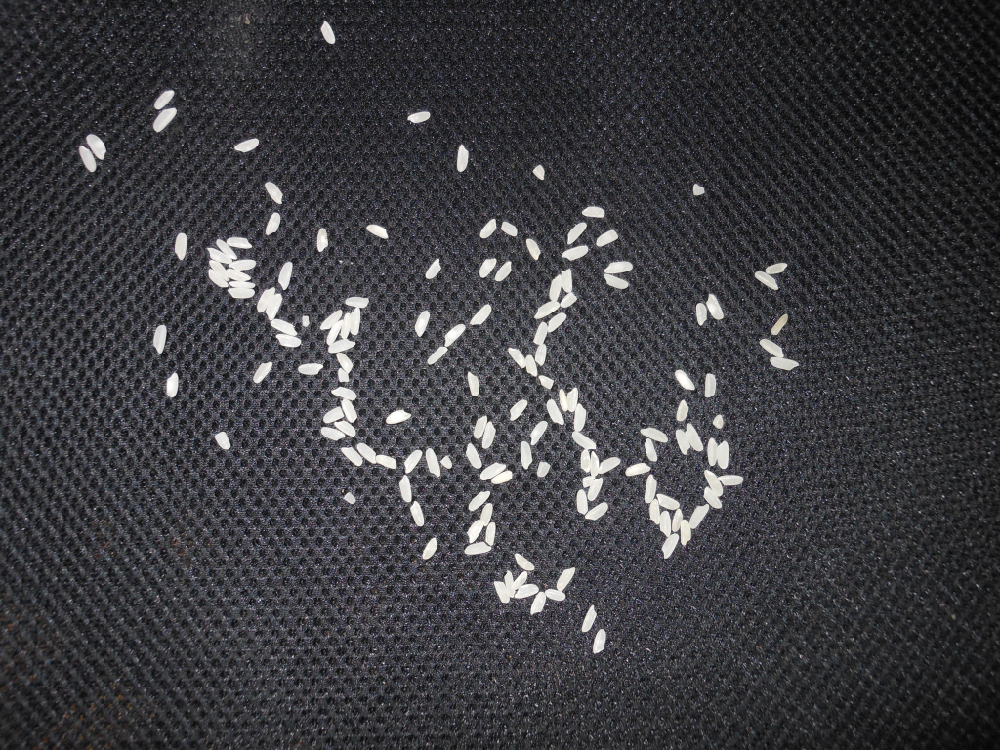
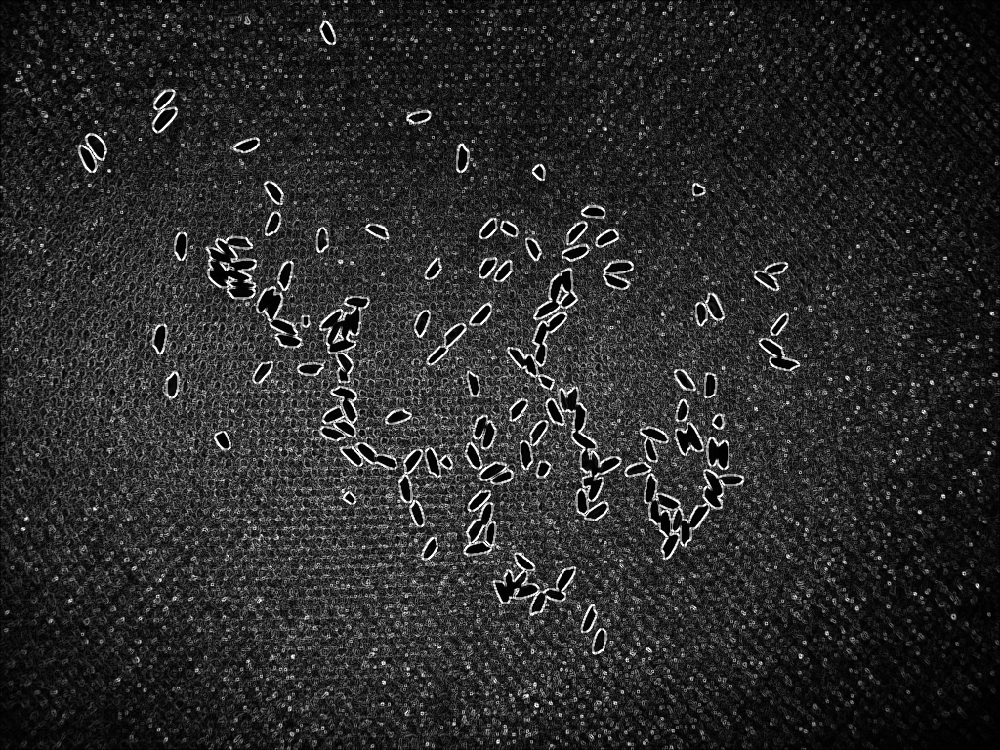

# Py-Component-labeling
This is a Component Labeling code written in python, it uses some techniques to remove or decrease noise as follow:

Original image:  
 
Sobel + bilateralFilter  
 
Treshold OTSU + morphology  
 
Final result:  

The parameters are  very flexible to change, you can  fine tune to adapt better to your images, such as:

<b>cv2.bilateralFilter()  
cv2.threshold() 
cv2.morphologyEx() 
cv2.Canny() 
cv2.dilate()</b>

